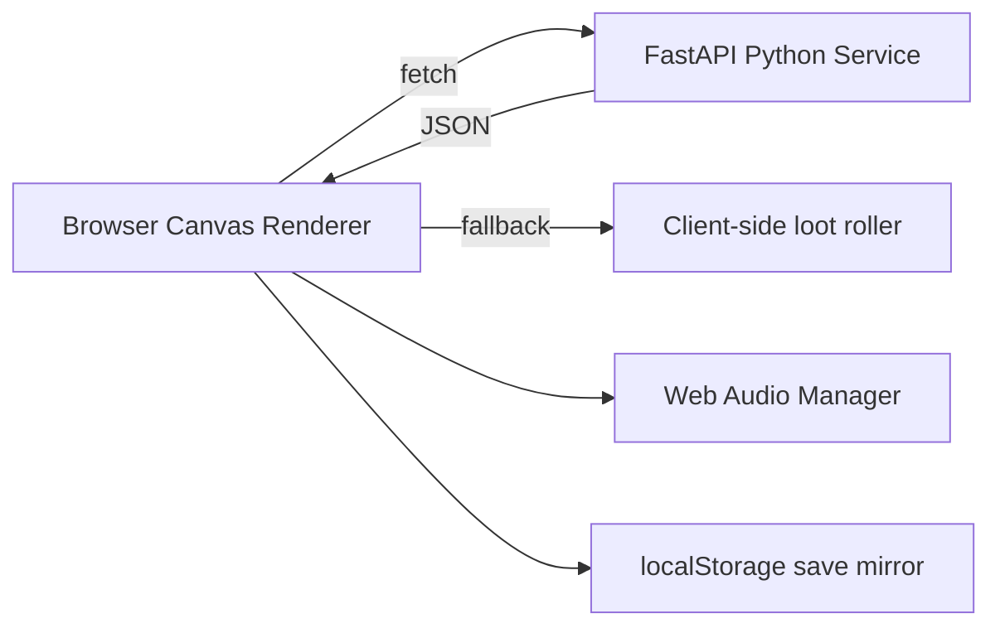

# RetroVania | Rogue-like Platformer

RetroVania is a retro-inspired full-stack rogue-like platformer blending SNES-style 2D sprite art, open-source chiptune SFX, deterministic seeded runs, and Python-backed loot/persistence inside a TypeScript/Next.js app. It was built in collaboration with AI coding agents to demonstrate agentic development workflows alongside core software engineering fundamentals.


**Last docs sync:** 2026-07-15 (RetroVania title, full-bleed start screen, watermark repair, and living-document truth sync)

> Built for the **Next Chapter bootcamp** capstone submission.

**🎮 Play the beta live: [straydogsyn.github.io/Next-Chapter-Retro-Game](https://straydogsyn.github.io/Next-Chapter-Retro-Game/)** — see [docs/BETA_TESTING.md](docs/BETA_TESTING.md) for what's being tested, known limitations, and how to file bugs.

---

## Table of Contents

- [Overview](#overview)
- [Tech Stack](#tech-stack)
- [Architecture](#architecture)
- [Features](#features)
- [Getting Started](#getting-started)
- [Project Structure](#project-structure)
- [Screenshots](#screenshots)
- [AI Collaboration](#ai-collaboration)
- [Assets & Credits](#assets--credits)
- [Roadmap](#roadmap)
- [License](#license)

---

## Overview

This project is two things at once, on purpose:

1. **A playable retro game** — SNES-era pixel aesthetics, hand-rolled canvas rendering, chiptune SFX, and a 24-room Metroidvania-style world with three bosses.
2. **A demonstration of agentic pairing** — every major build phase was worked through with an AI coding agent, and that process is documented as a first-class part of the submission, not an afterthought.

The Python backend isn't decorative — it owns authoritative loot rolls and hosted persistence, while the Next.js frontend owns rendering, input, UI, and deterministic relabeling of the hand-authored room graph. The legacy `/generate-level` scaffold endpoint is not used by the game client. See [Architecture](#architecture) for the full rationale.

## Current Project State

- **Live URL:** [straydogsyn.github.io/Next-Chapter-Retro-Game](https://straydogsyn.github.io/Next-Chapter-Retro-Game/)
- **Current version:** **v0.2.0**, branded as **RetroVania | Rogue-like Platformer** in browser metadata and the canvas start screen.
- **Start screen:** Full-bleed responsive canvas, one-line fitted title, and a square StrayDog Syndications stencil watermark beside the version footer; fresh live-capture verification remains part of the polish checklist.
- **Gameplay status:** Playable 24-room build with 5 zones, 4 regular enemies, 3 bosses, seeded room-order shuffling, run summary, and shrine-backed save flow.
- **Service status:** Static frontend export on GitHub Pages with Python persistence/loot service designed for Render + Neon.
- **Latest gameplay upgrades:** Space Marine movement overhaul and seeded room-order shuffle landed (ADR-027/ADR-028/ADR-029), with explicit ability-gate door tiles to preserve progression even after jump buffs.
- **Quality status:** Vitest suite wired in-project (`npm test`), with active code-review backlog tracked in `docs/BUGS_IMPROVEMENT_GUIDE.md`.
- **Documentation status:** Living AI-Augmentation docs are current and governed by archive-first policy (`docs/archive/historical/`).


## Tech Stack

| Layer | Tech | Why |
|---|---|---|
| Frontend | Next.js 14, React 18, TypeScript 5.9, Tailwind CSS 3.4 | Type-safe App Router UI and responsive presentation |
| Rendering | HTML5 Canvas (no game engine) | Demonstrates fundamentals — render loop, delta time, collision, and sprite state machines — rather than hiding them behind a library |
| Backend | Python + FastAPI | Authoritative loot and persistence service — see [docs/ARCHITECTURE.md](docs/ARCHITECTURE.md) |
| Persistence | Neon PostgreSQL + `localStorage` fallback | Hosted continuity with offline/degraded-mode resilience |
| Testing | Vitest 4.1 + TypeScript compiler | Pure-logic regression coverage and strict type validation |
| Deployment | GitHub Pages + Render + Neon | Static frontend with independently deployable service and database |
| Audio | Web Audio API | Native browser audio with no runtime audio framework |
| Sprites | Script-processed open-source spritesheets | Deterministic metadata-driven clips and pixel-art rendering |

## Architecture

<details>
<summary><strong>Click to expand system overview</strong></summary>



The Next.js app owns rendering, input, and UI. The Python service owns logic that benefits from being outside the request/render cycle — see the full writeup and rationale in [docs/ARCHITECTURE.md](docs/ARCHITECTURE.md).

</details>

### Architecture diagram


## Features

<details>
<summary><strong>Core gameplay loop</strong></summary>

- `requestAnimationFrame`-based game loop with delta-time movement
- 24 single-screen rooms across 5 zones, validated at load by `lib/game/levelLoader.ts`
- Sprite animation state machine (idle / walk / jump / attack); hero swapped to swm `char-sheet-alpha.png` + 8 palette variants (ADR-020), with a `24×44` collision body and `61×64` feet-centered render box for the Space Marine overhaul
- Full-bleed responsive start screen with the canonical RetroVania title and StrayDog v0.2.0 watermark
- Unified keyboard + Xbox gamepad + touch input handler; virtual gamepad and tactical tap modes (ADR-021)
- React HUD header and footer layered outside the canvas (HP, XP, coins, weapon, minimap, loot/save source, control hints)
- 4 regular enemy types + 3 bosses with distinct AI patterns
- Deterministic seeded RNG with forked loot/combat/shop streams; Daily Seed and Enter Seed modes
- Run-summary screen on death/victory showing seed, time, rooms visited, coins, level, and enemies defeated
- Save system: shrine checkpoints + server mirroring + `localStorage` fallback (ADR-010)
- Status chip showing online/degraded mode at a glance

</details>

<details>
<summary><strong>Frontend ↔ backend integration</strong></summary>

- The browser calls the Python FastAPI service directly (`lib/game/loot-client.ts` → `/loot/roll`, `lib/game/save-client.ts` → `/save`, `/load`, `/players/register`) — no Next.js API-route proxy, since the site deploys as a static export with no server at runtime (ADR-008/ADR-009); python-service has CORS enabled for the dev and GitHub Pages origins
- Client-side loot fallback mirrors the loot tables for offline resilience; every drop is tagged `python-service` or `client-fallback`
- Anonymous player identity via UUID stored in `localStorage`; saves round-trip to the hosted Render service and Neon database when online, or fall back to browser storage when offline

</details>

## Getting Started

```bash
# 1. Clone
git clone https://github.com/StrayDogSyn/Next-Chapter-Retro-Game.git
cd Next-Chapter-Retro-Game

# 2. Frontend
npm install
npm run dev          # http://localhost:3000

# 3. Backend (separate terminal)
cd python-service
python -m venv venv
source venv/bin/activate   # Windows: venv\Scripts\activate
pip install -r requirements.txt
uvicorn main:app --reload  # http://localhost:8000
```

The browser fetches the Python service directly at `NEXT_PUBLIC_PYTHON_SERVICE_URL` (defaults to `http://127.0.0.1:8000` if unset — fine for local dev). Set it as a build-time env var if you deploy python-service somewhere other than localhost.

## Project Structure

```
├── app/                # Next.js routes and API routes
├── components/         # Canvas renderer, header/footer HUD, menu components, touch overlay
├── lib/                # Game loop, input, world, items, audio manager, save/loot clients
├── python-service/     # FastAPI app for loot rolling, persistence, and procedural generation
├── public/
│   ├── assets/          # Extracted asset packs + manifest.json
│   ├── sprites/         # Packed spritesheets + spritemeta.json
│   └── audio/           # CC0/open-source SFX and music
├── assets/              # Source asset zips, manifests, and screenshots
├── downloads/           # Archived source zip downloads
├── scripts/             # Asset pipeline and ground-truth status tools
└── docs/                # Living documentation
    └── archive/historical/  # Superseded briefs and legacy imports (not deleted)
```

## Screenshots

| Start Screen | Loading Sequence |
| --- | --- |
|  |  |

| Gameplay Loop | Controls Menu |
| --- | --- |
|  |  |

| High Scores | Revamped Level |
| --- | --- |
|  |  |

| AI-Augmentation Workflow Capture |
| --- |
|  |

### Responsive canvas scaling

The runtime and start-screen canvases fill their available containers. Each retains a fixed logical drawing coordinate system while CSS and device-pixel-ratio-aware backing buffers scale the presentation to the viewport; the current full-bleed design intentionally does not enforce letterboxing.

### Playtest


For a historical timeline of the game's visual evolution (including legacy captures), see [docs/VISUAL_PROGRESSION.md](docs/VISUAL_PROGRESSION.md).

## AI Collaboration

This project was built through paired programming with AI coding agents. Every session, prompt, and architectural decision made in that process is tracked as living documentation rather than folded silently into the commit history. A senior-engineer code review of the current main branch is also logged as a first-class artifact.

**Start here:** [docs/AGENTIC_WORKFLOW.md](docs/AGENTIC_WORKFLOW.md)

**Latest review backlog:** [docs/BUGS_IMPROVEMENT_GUIDE.md](docs/BUGS_IMPROVEMENT_GUIDE.md#cr-findings-2026-07-14)

## Assets & Credits

<details>
<summary><strong>Sprite & audio sourcing</strong></summary>

All third-party assets are CC0 or explicitly licensed for reuse. The runtime assets wired into the game are documented in [docs/CREDITS.md](docs/CREDITS.md), which is regenerated from the asset pipeline's ground-truth output (`assets/wired-assets.txt`) and the download manifests. For future sourcing, see [docs/ASSET_SOURCES.md](docs/ASSET_SOURCES.md).

- **Sprites:** OpenGameArt.org CC0 packs plus hand-authored edits (werewolf boss, wyrmwolf, mech, hero, goblin, imp, bat, flower, tilesets, backgrounds)
- **SFX / music:** Freesound and OpenGameArt CC0 chiptune packs (jump, hit, coin, shoot, sword, laser, boss music, etc.)

</details>

## Roadmap

### Shipped
- [x] Core render loop + sprite animation state machine
- [x] Python service wired to loot generation and persistence
- [x] Real sprite/audio assets swapped in via the asset pipeline
- [x] Living documentation structure and ADRs
- [x] Full-bleed responsive canvas + header/footer HUD refactor
- [x] RetroVania title synchronized across start-screen canvas and browser metadata; StrayDog v0.2.0 watermark wired
- [x] Level progression save state and inventory persistence (shrines + server + localStorage fallback, ADR-010)
- [x] Daily/Enter Seed modes and run-summary screen (ADR-017)
- [x] Touch controls — Pointer Events, auto/on/off policy (ADR-021)
- [x] Public deploy on GitHub Pages + Render + Neon
- [x] Hero sprite swapped to verified swm `char-sheet-alpha.png` + 8 palette variants (ADR-020)
- [x] Senior-engineer code review of main branch; CR-001..CR-013 findings logged

### In progress / next
- [ ] Code-review follow-ups across CR-001..CR-023 (open: CR-001, CR-006, CR-011, CR-019..CR-023 — see [docs/BUGS_IMPROVEMENT_GUIDE.md](docs/BUGS_IMPROVEMENT_GUIDE.md#cr-findings-2026-07-14))
- [ ] Capture and publish a fresh start-screen screenshot verifying full-bleed placement, exact RetroVania title, and visible square watermark
- [ ] Continue sprite asset utilization (AST-014 shipped; AST-015 partial; AST-016..AST-020 remain: coherent swm biome, tile-variation pools, zone backdrops, boss integration, and purge-list execution)
- [ ] Zone-specific ambient/music
- [ ] Deployment hardening follow-through (credential-rotation gate + production backend verification evidence)
- [ ] Bootcamp submission polish pass

## License

MIT — see `LICENSE`.
