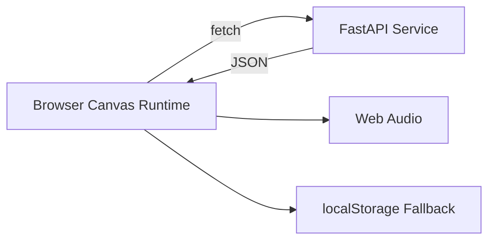
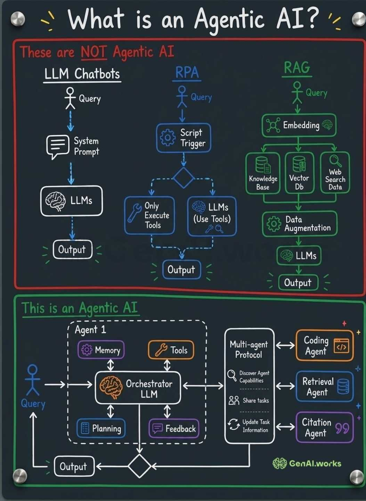
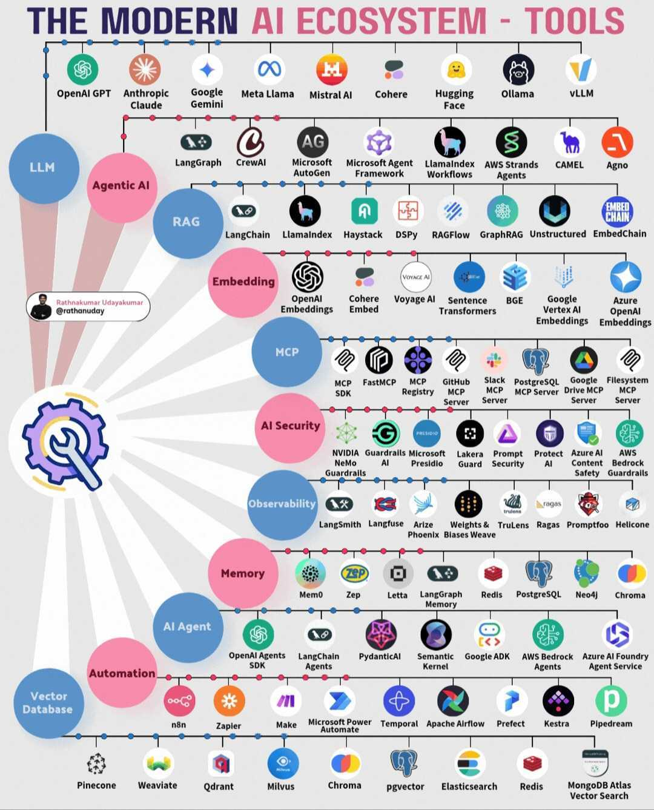
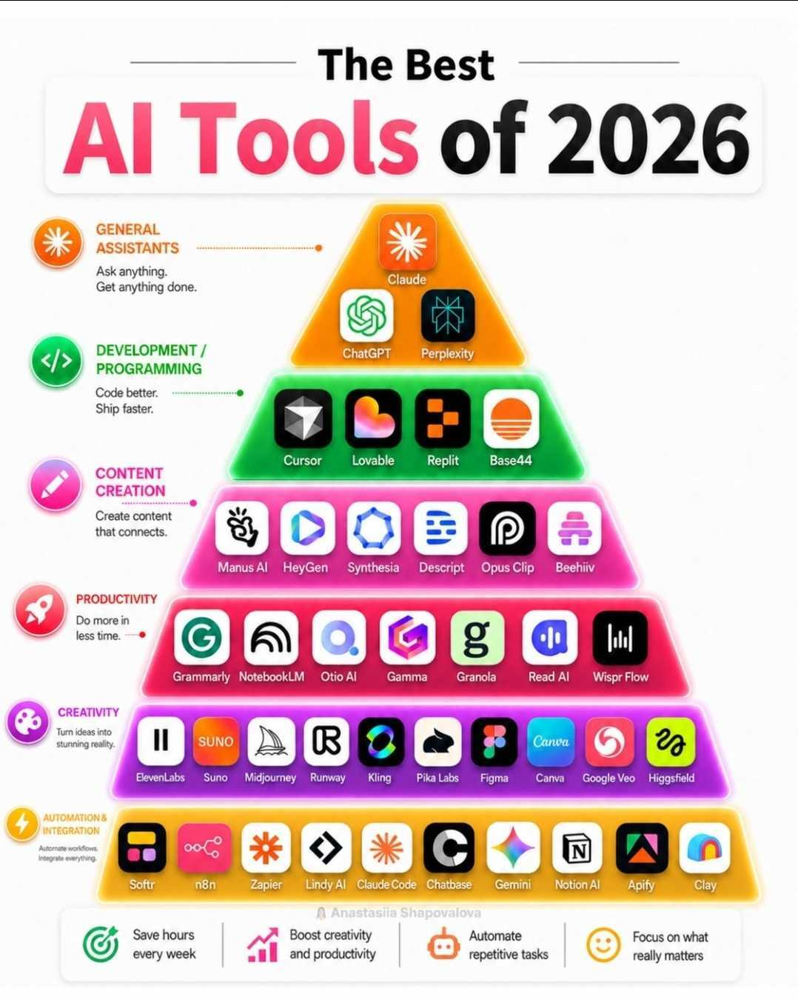
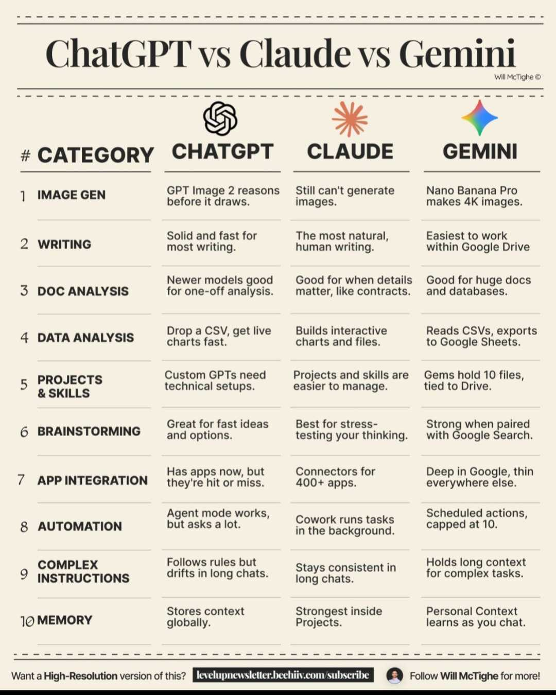

# RetroVania | Rogue-like Platformer

A full-stack retro platformer built for admissions review with a custom Canvas runtime, deterministic seeded runs, Python-backed systems, and complete AI-assisted engineering evidence.

<div align="center">


</div>

## Reviewer Entry Points

<div align="center">

[<span style="color:#63ff63;font-family:'Courier New',monospace;font-weight:700;letter-spacing:0.08em;font-size:1.05rem;">Do You Want To Play A Game?</span>](index.html)

</div>

## Why This Project

Most portfolio projects demonstrate UI assembly. RetroVania demonstrates systems engineering: real-time gameplay loops, deterministic replayability, multi-layer state management, data-backed progression, and a documented AI collaboration process with verification gates.

## Core Features

- Hand-rolled Canvas runtime with `requestAnimationFrame` (no Phaser/Pixi).
- 24 connected rooms across five zones.
- Four enemy classes and three bosses.
- Melee and projectile combat with visual FX and hit feedback.
- Deterministic seeded runs with forked RNG streams.
- Loot, inventory, equip, sell, and scrap systems.
- Keyboard, gamepad, and touch input support.
- Static frontend deployment with service-backed data endpoints.

## Architecture Snapshot

<details>
<summary><strong>Architecture Snapshot</strong></summary>



Primary architecture documentation: [docs/ARCHITECTURE.md](docs/ARCHITECTURE.md)

</details>

## Modern AI Ecosystem

> **This project was not built by prompting a single chatbot.** It was orchestrated: seven tools, each assigned to the work it's structurally best at, with every claim of "done" checked against the actual filesystem and git state rather than an agent's own narration.

<details>
<summary><strong>What Is Agentic?</strong></summary>

<div align="center">



<sub>Source: GenAI.works — full attribution in <a href="docs/archive/CREDITS.md">docs/archive/CREDITS.md</a></sub>

</div>

A single chatbot session — even a long one — is a query-in, output-out loop with no memory of its own decisions and no way to hand work to a tool better suited for it. What this project actually ran looks like the bottom half of the diagram above: an orchestration layer routing work across specialized agents, each with its own tools, verification step, and feedback path back into the next prompt. `docs/AGENTIC_WORKFLOW.md` is the literal session-by-session record of that loop in practice.

</details>

<details>
<summary><strong>Modern AI Ecosystem</strong></summary>

<div align="center">



<sub>Source: Rathnakumar Udayakumar (@rathanuday) — full attribution in <a href="docs/archive/CREDITS.md">docs/archive/CREDITS.md</a></sub>

</div>

Plotted against that landscape, this project's stack is a deliberately narrow slice: general-purpose LLM agents for implementation and reasoning, paired with browser-based research tools for sourcing and verification — not a vector database, not a custom agent framework, not an orchestration SDK. For a single-developer capstone on a fixed timeline, that scope was the point: five tools doing distinct jobs well beats one framework doing all of them adequately.

</details>

### The Multi-Agent Stack

| Tool | Role |
|---|---|
| **Gemini Pro** | Lead architectural sounding board, prompt engineering, and workflow manager — drafted the mission-scoped prompts that structured each implementation sprint |
| **Claude Code** | Deep implementation, state-machine logic, and React architectural overhauls — the primary hands-on agent for engine code, physics, and UI |
| **Windsurf Cascade** | Broad multi-file logic integration, dependency auditing, and deterministic procedural generation rules |
| **VS Code CoPilot** | Granular file-system patching, UI polishing, and strict rubric-compliance audits |
| **Perplexity & Comet Web Browser** | Automated in-browser verification, open-source asset sourcing, and lightweight technical research |

<sub>Devin Cloud also ran supplementary background/investigation tasks outside the main implementation loop — see `docs/AGENTIC_WORKFLOW.md` for the full seven-tool breakdown.</sub>

<details>
<summary><strong>Why category leaders, not generalists</strong></summary>

<div align="center">



<sub>Source: Anastasiia Shapovalova — full attribution in <a href="docs/archive/CREDITS.md">docs/archive/CREDITS.md</a></sub>

</div>

Every tool in the stack above sits at the top of a specific category rather than being a jack-of-all-trades pick: Claude for sustained implementation reasoning, Gemini for fast architectural iteration, Copilot for in-editor patching, Perplexity/Comet for research and browser verification. The alternative — one model asked to draft architecture, write state machines, audit dependencies, *and* verify its own output — is exactly the failure mode `docs/AGENTIC_WORKFLOW.md`'s Retro & Learnings section documents: agents narrating completed work that the file tree didn't back up.

</details>

<details>
<summary><strong>Routing logic: why not a single model for everything</strong></summary>

<div align="center">



<sub>Source: Will McTighe (© — used for educational commentary with attribution; full detail in <a href="docs/archive/CREDITS.md">docs/archive/CREDITS.md</a>)</sub>

</div>

This table compares the three leading general-purpose model families on exactly the axes that matter for routing a real engineering workflow: which one holds context longest, which stays consistent across a long back-and-forth, which is strongest at stress-testing a plan versus executing it. This project's own routing followed that same logic — Gemini for fast architectural back-and-forth, Claude for long, consistent implementation sessions — while deliberately staying out of the GPT family for the implementation loop; the roster in `docs/AGENTIC_WORKFLOW.md` reflects a two-model-family split (Anthropic + Google) plus purpose-built coding agents, not a three-way split across all of the above.

</details>

---

## Documentation Map

- Workflow and engineering narrative: [docs/AGENTIC_WORKFLOW.md](docs/AGENTIC_WORKFLOW.md)
- Prompt history summary: [docs/PROMPT_HISTORY.md](docs/PROMPT_HISTORY.md)
- Session archive: [docs/archive/SESSION_LOG.md](docs/archive/SESSION_LOG.md)
- Prompt library archive: [docs/archive/PROMPT_LIBRARY.md](docs/archive/PROMPT_LIBRARY.md)
- Architecture decisions archive: [docs/archive/DECISIONS.md](docs/archive/DECISIONS.md)
- Build and phase planning: [docs/MASTER_BUILD_SPEC.md](docs/MASTER_BUILD_SPEC.md)
- Beta scope and testing notes: [docs/archive/BETA_TESTING.md](docs/archive/BETA_TESTING.md)

## Technology Stack

- Next.js 14 + React 18 + TypeScript
- HTML5 Canvas rendering
- FastAPI (Python service)
- Neon PostgreSQL
- Vitest + TypeScript compilation checks
- GitHub Pages (frontend) + Render (service)

## Local Setup

```bash
# Clone
git clone https://github.com/StrayDogSyn/Next-Chapter-Retro-Game.git
cd Next-Chapter-Retro-Game

# Frontend
npm install
npm run dev

# Backend (new terminal)
cd python-service
python -m venv venv
# Windows:
venv\Scripts\activate
# macOS/Linux:
# source venv/bin/activate
pip install -r requirements.txt
uvicorn main:app --reload
```

## Build and Deployment Validation

```bash
npm run build
npm run preview
```

`npm run build` generates static export output in `out/` (including `out/index.html`).

Production routing is configured in [next.config.mjs](next.config.mjs) using:

- `basePath: /Next-Chapter-Retro-Game`
- `assetPrefix: /Next-Chapter-Retro-Game/`

This ensures GitHub Pages serves the app from the repository subpath with valid asset URLs.

## Project Layout

- [app](app) - Next.js routes, layout, and styling entry points
- [components](components) - Canvas host and UI overlays
- [lib](lib) - Runtime/game systems and shared utilities
- [python-service](python-service) - FastAPI service and persistence logic
- [public](public) - Runtime assets
- [docs](docs) - Active and archived engineering documentation

## License

MIT. See [LICENSE](LICENSE).
