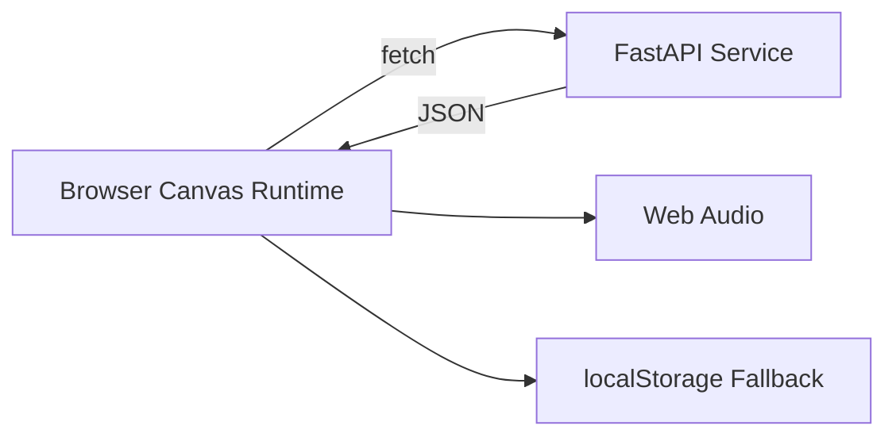

# RetroVania | Rogue-like Platformer

A full-stack retro platformer built for admissions review with a custom Canvas runtime, deterministic seeded runs, Python-backed systems, and complete AI-assisted engineering evidence.

<div align="center">


</div>

## Reviewer Entry Points

- Live submission entry (GitHub Pages index): https://straydogsyn.github.io/Next-Chapter-Retro-Game/
- Repository submission portal source: [index.html](index.html)
- Project source code: https://github.com/StrayDogSyn/Next-Chapter-Retro-Game
- Prompt history (submission-ready): [docs/PROMPT_HISTORY.md](docs/PROMPT_HISTORY.md)

## Why This Project

Most portfolio projects demonstrate UI assembly. RetroVania demonstrates systems engineering: real-time gameplay loops, deterministic replayability, multi-layer state management, data-backed progression, and a documented AI collaboration process with verification gates.

## Core Features

- Hand-rolled Canvas runtime with `requestAnimationFrame` (no Phaser/Pixi).
- 24 connected rooms across five zones.
- Four enemy classes and three bosses.
- Melee and projectile combat with visual FX and hit feedback.
- Deterministic seeded runs with forked RNG streams.
- Loot, inventory, equip, sell, and scrap systems.
- Keyboard, gamepad, and touch input support.
- Static frontend deployment with service-backed data endpoints.

## Architecture Snapshot



Primary architecture documentation: [docs/ARCHITECTURE.md](docs/ARCHITECTURE.md)

## Documentation Map

- Workflow and engineering narrative: [docs/AGENTIC_WORKFLOW.md](docs/AGENTIC_WORKFLOW.md)
- Prompt history summary: [docs/PROMPT_HISTORY.md](docs/PROMPT_HISTORY.md)
- Session archive: [docs/archive/SESSION_LOG.md](docs/archive/SESSION_LOG.md)
- Prompt library archive: [docs/archive/PROMPT_LIBRARY.md](docs/archive/PROMPT_LIBRARY.md)
- Architecture decisions archive: [docs/archive/DECISIONS.md](docs/archive/DECISIONS.md)
- Build and phase planning: [docs/MASTER_BUILD_SPEC.md](docs/MASTER_BUILD_SPEC.md)
- Beta scope and testing notes: [docs/archive/BETA_TESTING.md](docs/archive/BETA_TESTING.md)

## Technology Stack

- Next.js 14 + React 18 + TypeScript
- HTML5 Canvas rendering
- FastAPI (Python service)
- Neon PostgreSQL
- Vitest + TypeScript compilation checks
- GitHub Pages (frontend) + Render (service)

## Local Setup

```bash
# Clone
git clone https://github.com/StrayDogSyn/Next-Chapter-Retro-Game.git
cd Next-Chapter-Retro-Game

# Frontend
npm install
npm run dev

# Backend (new terminal)
cd python-service
python -m venv venv
# Windows:
venv\Scripts\activate
# macOS/Linux:
# source venv/bin/activate
pip install -r requirements.txt
uvicorn main:app --reload
```

## Build and Deployment Validation

```bash
npm run build
npm run preview
```

`npm run build` generates static export output in `out/` (including `out/index.html`).

Production routing is configured in [next.config.mjs](next.config.mjs) using:

- `basePath: /Next-Chapter-Retro-Game`
- `assetPrefix: /Next-Chapter-Retro-Game/`

This ensures GitHub Pages serves the app from the repository subpath with valid asset URLs.

## Project Layout

- [app](app) - Next.js routes, layout, and styling entry points
- [components](components) - Canvas host and UI overlays
- [lib](lib) - Runtime/game systems and shared utilities
- [python-service](python-service) - FastAPI service and persistence logic
- [public](public) - Runtime assets
- [docs](docs) - Active and archived engineering documentation

## License

MIT. See [LICENSE](LICENSE).
