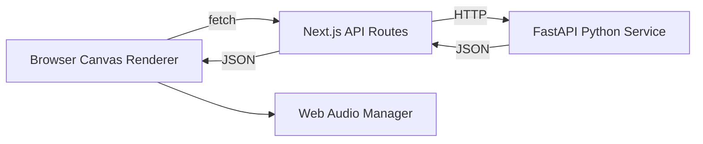

# Next-Chapter-Retro-Game

A retro-inspired full-stack showcase blending SNES-style 2D sprite art, open-source chiptune SFX, and Python-powered game logic inside a TypeScript/Next.js app — built in collaboration with AI coding agents to demonstrate agentic development workflows alongside core software engineering fundamentals.


> Built for the **Next Chapter bootcamp** capstone submission.

---

## Table of Contents

- [Overview](#overview)
- [Tech Stack](#tech-stack)
- [Architecture](#architecture)
- [Features](#features)
- [Getting Started](#getting-started)
- [Project Structure](#project-structure)
- [AI Collaboration](#ai-collaboration)
- [Assets & Credits](#assets--credits)
- [Roadmap](#roadmap)
- [License](#license)

---

## Overview

This project is two things at once, on purpose:

1. **A playable retro game** — SNES-era pixel aesthetics, hand-rolled canvas rendering, chiptune SFX.
2. **A demonstration of agentic pairing** — every major build phase was worked through with an AI coding agent (GitHub Copilot's cloud agent), and that process is documented as a first-class part of the submission, not an afterthought.

The Python backend isn't decorative — it exists to prove a specific architectural point. See [Architecture](#architecture) for why.

## Tech Stack

| Layer | Tech | Why |
|---|---|---|
| Frontend | Next.js 14 (App Router) + TypeScript | Type-safe, modern React conventions, SSR-capable |
| Rendering | HTML5 Canvas (no game engine) | Demonstrates fundamentals — render loop, delta time, sprite state machines — rather than hiding them behind a library |
| Backend | Python (FastAPI) | Isolated service for logic that's a better fit in Python — see [docs/ARCHITECTURE.md](docs/ARCHITECTURE.md) |
| Audio | Web Audio API | Native browser audio, no dependency needed for simple SFX playback |
| Sprites | Hand-authored/CC0 spritesheets | 16x16 / 32x32 grid, SNES-style palette constraints |

## Architecture

<details>
<summary><strong>Click to expand system overview</strong></summary>



The Next.js app owns rendering, input, and UI. The Python service owns logic that benefits from being outside the request/render cycle — see the full writeup and rationale in [docs/ARCHITECTURE.md](docs/ARCHITECTURE.md).

</details>

## Features

<details>
<summary><strong>Core gameplay loop</strong></summary>

- `requestAnimationFrame`-based game loop with delta-time movement
- Sprite animation state machine (idle / walk / jump)
- Keyboard input handler
- HUD overlay (score/lives) rendered as React components layered over the canvas

</details>

<details>
<summary><strong>Frontend ↔ backend integration</strong></summary>

- Working fetch call from Next.js to the Python service, proving the two halves communicate
- Python service returns game-logic data (procedural generation / scoring / AI opponent — see architecture doc for which)

</details>

## Getting Started

```bash
# 1. Clone
git clone https://github.com/StrayDogSyn/Next-Chapter-Retro-Game.git
cd Next-Chapter-Retro-Game

# 2. Frontend
npm install
npm run dev          # http://localhost:3000

# 3. Backend (separate terminal)
cd python-service
python -m venv venv
source venv/bin/activate   # Windows: venv\Scripts\activate
pip install -r requirements.txt
uvicorn main:app --reload  # http://localhost:8000
```

## Project Structure

```
├── app/                # Next.js routes and pages
├── components/         # Canvas renderer, HUD, menu components
├── lib/                # Game loop, sprite animation controller, audio manager
├── python-service/     # FastAPI app + its own README
├── public/
│   ├── sprites/         # Spritesheet assets
│   └── audio/           # CC0/open-source SFX
└── docs/                # Living documentation (see below)
    └── archive/
        └── historical/  # Deprecated/superseded docs kept for traceability
```

## AI Collaboration

This project was built through paired programming with an AI coding agent. Every session, prompt, and architectural decision made in that process is tracked as living documentation rather than folded silently into the commit history.

**Start here:** [docs/AGENTIC_WORKFLOW.md](docs/AGENTIC_WORKFLOW.md)

## Assets & Credits

<details>
<summary><strong>Sprite & audio sourcing</strong></summary>

- Sprites: *[fill in — e.g. opengameart.org, itch.io CC0 packs, hand-authored]*
- SFX: *[fill in — e.g. freesound.org, CC0 chiptune packs]*
- All third-party assets are CC0 or explicitly licensed for reuse; attributions listed here as sourced.

</details>

## Roadmap

- [ ] Core render loop + sprite state machine
- [ ] Python service wired to at least one gameplay mechanic
- [ ] Real sprite/audio assets swapped in
- [ ] Living documentation fully backfilled
- [ ] Bootcamp submission polish pass

## License

MIT — see `LICENSE`.
