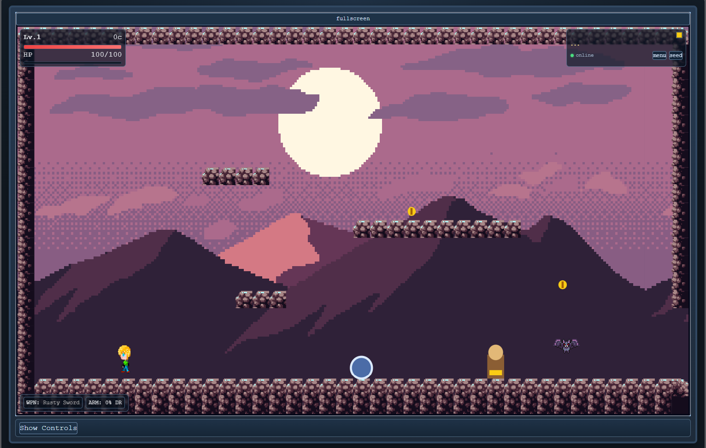
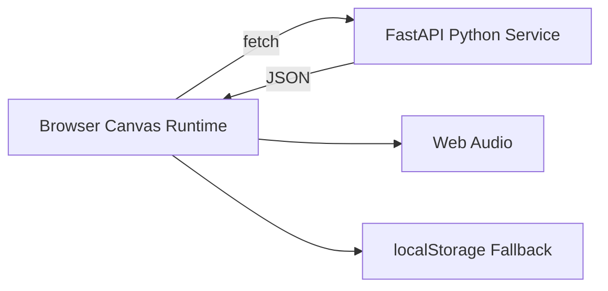

# RetroVania | Rogue-like Platformer

A retro-inspired full-stack rogue-like platformer built as a Next Chapter admissions project. It combines a hand-rolled canvas game engine, deterministic seeded runs, and Python-backed loot/persistence while documenting real AI-paired development end to end.

**Reviewer Quick Check**

- Live demo: https://straydogsyn.github.io/Next-Chapter-Retro-Game/
- Prompt history file: `prompt-history.md` (repo root)
- AI workflow evidence: `docs/AGENTIC_WORKFLOW.md`, `docs/SESSION_LOG.md`
- Build command: `npm run build` (generates `/out/index.html` for static export)




## Project Name

RetroVania | Rogue-like Platformer

## Live Demo

Play the live build on GitHub Pages:

https://straydogsyn.github.io/Next-Chapter-Retro-Game/

For active testing scope and known limitations, see `docs/BETA_TESTING.md`.

## Problem

Many static portfolio projects are fast to skim but hard to evaluate for real engineering depth. They can show layout and styling, but often do not clearly demonstrate sustained logic design, state orchestration, debugging under pressure, and iterative delivery.

This project addresses that gap by shipping a playable, systems-heavy application where reviewers can directly observe collisions, combat loops, progression systems, persistence behavior, and resilience paths.

## Value

This project creates value in two ways:

1. For players/testers: a playable retro action game with deterministic seeds, progression, and replayability.
2. For admissions reviewers: direct evidence that complex software was planned, implemented, audited, debugged, and improved through effective AI collaboration rather than one-shot code generation.

The result is a submission that demonstrates:

- Complex logic composition (physics, combat, AI, inventory, room graph traversal).
- Real state management across runtime/UI/save flows.
- Structured AI usage with verification, iteration, and documented decisions.
- Maintainable engineering habits through ADRs, session logs, and repeatable verification checkpoints.

## Project Plan

This project followed the phased approach tracked in `docs/MASTER_BUILD_SPEC.md`:

1. Foundation and refactor: establish core structure, verification workflow, and living documentation.
2. Rendering and sprites: canvas rendering, sprite animation system, and visual pipeline integration.
3. Gameplay systems: world graph, enemy/boss behavior, loot/inventory systems, and progression mechanics.
4. Reliability and QA: targeted bug audits, collision and reachability checks, strict verification gates.
5. Deployment and docs hardening: static export, live demo readiness, and submission-facing documentation quality.

Scope discipline was intentional: prioritize the smallest complete demonstration of value, then iterate safely.

## Features

### Core gameplay

- Hand-rolled `requestAnimationFrame` game loop (no Phaser/Pixi)
- 24 single-screen interconnected rooms across 5 zones
- 4 enemy types + 3 boss encounters
- Melee/projectile combat, damage/effects loops, and loot-driven progression
- Real inventory with equip/sell/scrap flows
- Shrine/save flow with server mirror + local fallback

### Replayability and progression

- Deterministic seeded runs with forked RNG streams
- Daily seed and manual seed-entry modes
- Run summary on death/victory (seed, time, progress, combat stats)
- Ability/key gating system integrated with world traversal

### Platform and UX support

- Keyboard + gamepad + touch input support
- React HUD + modal UI layered over canvas runtime
- Degraded-mode resilience when backend is unavailable
- Public deployment model: static frontend + independent Python service

### Architecture snapshot



See `docs/ARCHITECTURE.md` for full detail.

## Technologies Used

- HTML5 Canvas
- CSS (global styling + responsive game shell)
- JavaScript/TypeScript (Next.js + React)
- Next.js 14 (App Router, static export workflow)
- Python FastAPI (loot and persistence services)
- Neon PostgreSQL (persistence target)
- Vitest + TypeScript compiler checks
- GitHub Pages (frontend), Render (service), Neon (database)

## AI Tools Used

This project was built using AI pair-programming workflows with:

- Claude
- GitHub Copilot
- Windsurf Cascade

Comprehensive AI collaboration evidence is documented in:

- `docs/AGENTIC_WORKFLOW.md`
- `docs/SESSION_LOG.md`
- `docs/PROMPT_LIBRARY.md`
- `docs/DECISIONS.md`
- `prompt-history.md` (submission-ready condensed prompt sample)

## Running the Project

**Note for Reviewers: This project uses Next.js static export. The required `index.html` is automatically generated in the `/out` directory during the build process and correctly served by GitHub Pages.**

### Local development

```bash
# 1) Clone
git clone https://github.com/StrayDogSyn/Next-Chapter-Retro-Game.git
cd Next-Chapter-Retro-Game

# 2) Frontend
npm install
npm run dev

# 3) Backend (new terminal)
cd python-service
python -m venv venv
# Windows:
venv\Scripts\activate
# macOS/Linux:
# source venv/bin/activate
pip install -r requirements.txt
uvicorn main:app --reload
```

Frontend defaults to `http://localhost:3000` and the Python service to `http://127.0.0.1:8000`.

### Production/static export check

```bash
npm run build
```

This generates the static export output used for deployment (`/out`, including generated `index.html`).

### Project structure (high level)

- `app/` - Next.js App Router pages/layout/styles
- `components/` - canvas host, HUD, menus, overlays
- `lib/` - game loop, systems, input, data clients
- `python-service/` - FastAPI service and persistence logic
- `public/` - runtime-served assets
- `docs/` - architecture, ADRs, session history, prompt library

---

MIT licensed. See `LICENSE`.
