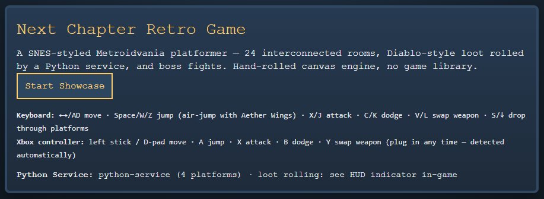
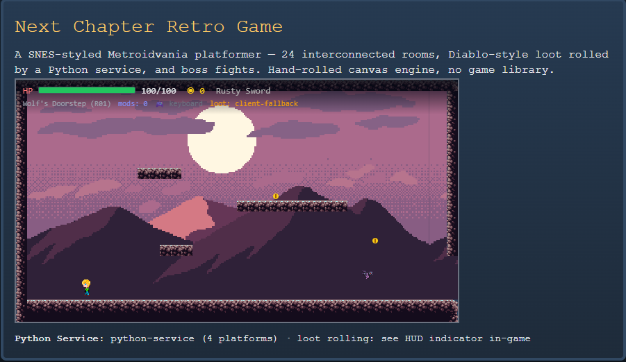
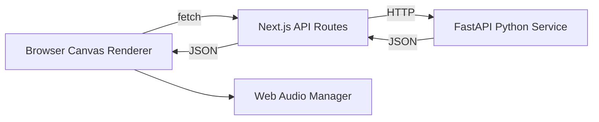
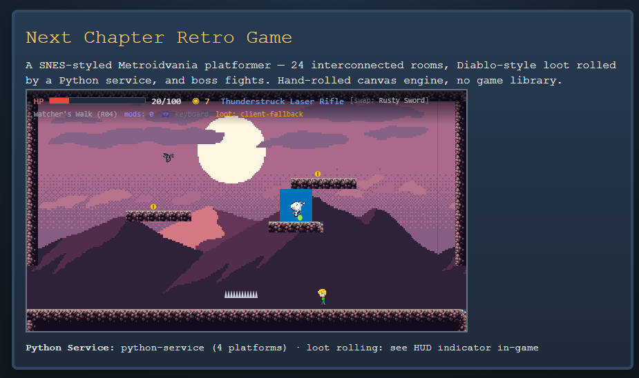

# Next-Chapter-Retro-Game

A retro-inspired full-stack showcase blending SNES-style 2D sprite art, open-source chiptune SFX, and Python-powered game logic inside a TypeScript/Next.js app — built in collaboration with AI coding agents to demonstrate agentic development workflows alongside core software engineering fundamentals.




> Built for the **Next Chapter bootcamp** capstone submission.

**🎮 Play the beta live: [straydogsyn.github.io/Next-Chapter-Retro-Game](https://straydogsyn.github.io/Next-Chapter-Retro-Game/)** — see [docs/BETA_TESTING.md](docs/BETA_TESTING.md) for what's being tested, known limitations, and how to file bugs.

---

## Table of Contents

- [Overview](#overview)
- [Tech Stack](#tech-stack)
- [Architecture](#architecture)
- [Features](#features)
- [Getting Started](#getting-started)
- [Project Structure](#project-structure)
- [Screenshots](#screenshots)
- [AI Collaboration](#ai-collaboration)
- [Assets & Credits](#assets--credits)
- [Roadmap](#roadmap)
- [License](#license)

---

## Overview

This project is two things at once, on purpose:

1. **A playable retro game** — SNES-era pixel aesthetics, hand-rolled canvas rendering, chiptune SFX, and a 24-room Metroidvania-style world with three bosses.
2. **A demonstration of agentic pairing** — every major build phase was worked through with an AI coding agent, and that process is documented as a first-class part of the submission, not an afterthought.

The Python backend isn't decorative — it owns procedural loot and level generation, while the Next.js frontend owns rendering, input, and UI. See [Architecture](#architecture) for the full rationale.



## Tech Stack

| Layer | Tech | Why |
|---|---|---|
| Frontend | Next.js 14 (App Router) + TypeScript | Type-safe, modern React conventions, SSR-capable |
| Rendering | HTML5 Canvas (no game engine) | Demonstrates fundamentals — render loop, delta time, sprite state machines — rather than hiding them behind a library |
| Backend | Python (FastAPI) | Isolated service for logic that's a better fit in Python — see [docs/ARCHITECTURE.md](docs/ARCHITECTURE.md) |
| Audio | Web Audio API | Native browser audio, no dependency needed for simple SFX playback |
| Sprites | Hand-authored/CC0 spritesheets | 16x16 / 32x32 grid, SNES-style palette constraints |

## Architecture

<details>
<summary><strong>Click to expand system overview</strong></summary>



The Next.js app owns rendering, input, and UI. The Python service owns logic that benefits from being outside the request/render cycle — see the full writeup and rationale in [docs/ARCHITECTURE.md](docs/ARCHITECTURE.md).

</details>

### Architecture diagram


## Features

<details>
<summary><strong>Core gameplay loop</strong></summary>

- `requestAnimationFrame`-based game loop with delta-time movement
- 24 single-screen rooms across 5 zones, validated at load by `lib/game/levelLoader.ts`
- Sprite animation state machine (idle / walk / jump / attack)
- Unified keyboard + Xbox gamepad input handler
- React HUD header and footer layered outside the canvas (HP, coins, weapon, loot source, control hints)
- 4 regular enemy types + 3 bosses with distinct AI patterns

</details>

<details>
<summary><strong>Frontend ↔ backend integration</strong></summary>

- The browser calls the Python FastAPI service directly (`lib/game/loot-client.ts` → `/loot/roll`) — no Next.js API-route proxy, since the site deploys as a static export with no server at runtime (ADR-008); python-service has CORS enabled for the dev and GitHub Pages origins
- Client-side fallback mirrors the loot tables for offline resilience; every drop is tagged `python-service` or `client-fallback`

</details>

## Getting Started

```bash
# 1. Clone
git clone https://github.com/StrayDogSyn/Next-Chapter-Retro-Game.git
cd Next-Chapter-Retro-Game

# 2. Frontend
npm install
npm run dev          # http://localhost:3000

# 3. Backend (separate terminal)
cd python-service
python -m venv venv
source venv/bin/activate   # Windows: venv\Scripts\activate
pip install -r requirements.txt
uvicorn main:app --reload  # http://localhost:8000
```

The browser fetches the Python service directly at `NEXT_PUBLIC_PYTHON_SERVICE_URL` (defaults to `http://127.0.0.1:8000` if unset — fine for local dev). Set it as a build-time env var if you deploy python-service somewhere other than localhost.

## Project Structure

```
├── app/                # Next.js routes and API routes
├── components/         # Canvas renderer, header/footer HUD, menu components
├── lib/                # Game loop, input, world, items, audio manager
├── python-service/     # FastAPI app for procedural generation and loot
├── public/
│   ├── sprites/         # Packed spritesheets + spritemeta.json
│   └── audio/           # CC0/open-source SFX and music
├── assets/              # Source assets, manifests, and screenshots
├── scripts/             # Asset pipeline and ground-truth status tools
└── docs/                # Living documentation (see below)
```

## Screenshots

| Game menu | Prototype gameplay |
| --- | --- |
|  |  |

### Responsive canvas scaling

The canvas keeps its internal 640×352 resolution but scales to fit the viewport while preserving aspect ratio and crisp pixel art.

### Playtest



## AI Collaboration

This project was built through paired programming with an AI coding agent. Every session, prompt, and architectural decision made in that process is tracked as living documentation rather than folded silently into the commit history.

**Start here:** [docs/AGENTIC_WORKFLOW.md](docs/AGENTIC_WORKFLOW.md)

## Assets & Credits

<details>
<summary><strong>Sprite & audio sourcing</strong></summary>

All third-party assets are CC0 or explicitly licensed for reuse. The runtime assets wired into the game are documented in [docs/CREDITS.md](docs/CREDITS.md), which is regenerated from the asset pipeline's ground-truth output (`assets/wired-assets.txt`) and the download manifests. For future sourcing, see [docs/ASSET_SOURCES.md](docs/ASSET_SOURCES.md).

- **Sprites:** OpenGameArt.org CC0 packs plus hand-authored edits (werewolf boss, wyrmwolf, mech, hero, goblin, imp, bat, flower, tilesets, backgrounds)
- **SFX / music:** Freesound and OpenGameArt CC0 chiptune packs (jump, hit, coin, shoot, sword, laser, boss music, etc.)

</details>

## Roadmap

- [x] Core render loop + sprite animation state machine
- [x] Python service wired to loot and procedural level generation
- [x] Real sprite/audio assets swapped in via `scripts/prepare-assets.py`
- [x] Living documentation structure and ADRs
- [x] Responsive canvas + header/footer HUD refactor
- [ ] Level progression save state and inventory persistence
- [ ] Bootcamp submission polish pass

## License

MIT — see `LICENSE`.
