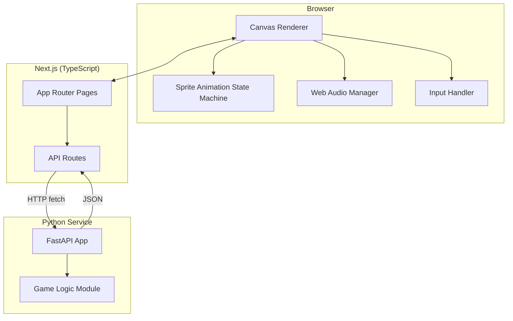

# Architecture

## System Diagram

## Why Python Exists Here

This stack is TypeScript-first by default — Python's presence needs to earn its place rather than be included for its own sake. The Python service owns:

> _fill in the specific mechanic once decided — e.g. procedural level generation, score/state validation, or a simple rule-based AI opponent. Pick one, document why it's a better fit in Python than TypeScript (e.g. numpy for procedural generation, a specific library not available in the JS ecosystem, or simply demonstrating polyglot competency deliberately)._

## Frontend Responsibilities

- Render loop (`requestAnimationFrame`, delta-time based movement)
- Sprite animation state machine (idle / walk / jump)
- Input handling
- Audio playback via Web Audio API
- HUD (React components layered over the canvas)

## Backend Responsibilities

- FastAPI service, run independently from the Next.js dev server
- Exposes JSON endpoints consumed by Next.js API routes (not called directly from the browser, to keep a clean boundary)

## Data Flow

1. Browser input → Canvas renderer updates local game state
2. When game state needs backend logic (e.g. a new level layout), Next.js API route calls the FastAPI service
3. FastAPI returns JSON → Next.js passes it to the client → Canvas renderer consumes it

## Open Questions / Future Work

- [ ] Decide the specific Python-side mechanic (see above)
- [ ] Determine if the Python service needs its own persistence layer or stays stateless
- [ ] Evaluate whether WebSocket communication is worth adding for real-time state sync
