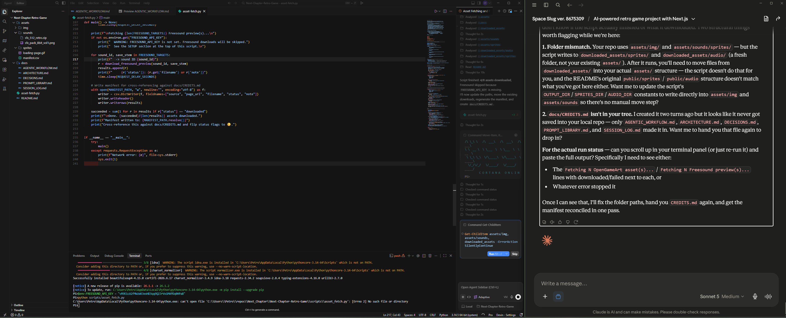

# Architecture

## System Diagram

```mermaid
flowchart TD
    subgraph Browser
        A[Canvas Renderer] --> B[Sprite Animation State Machine]
        A --> C[Web Audio Manager]
        A --> D[Input Handler]
        A --> E[Level Manager]
        A --> F[Enemy Manager]
        A --> G[Boss Manager]
        A --> H[Item Manager]
    end
    subgraph "Next.js (TypeScript)"
        I[App Router Pages] --> J[API Routes]
        A <--> I
    end
    subgraph "Python Service (FastAPI)"
        K[/generate-level]
        L[/generate-loot]
    end
    J -->|HTTP fetch| K
    J -->|HTTP fetch| L
    K -->|JSON| J
    L -->|JSON| J
```



## Why Python Exists Here

The Python service owns procedural generation because:

1. **Level layout generation** — Uses random seeding for reproducible but varied platform layouts
2. **Loot table generation** — Rarity-weighted drops with stat rolls (damage/crit_chance), affixes, and sale values
3. **Scalability** — Data-driven approach (JSON stat blocks returned to TypeScript) allows "dozens of weapons/items" via stat rolls, not hardcoded per-item classes
4. **Python-specific advantage** — Random module with seed support; numpy/scipy available for future procedural generation (terrain, noise, etc.)

The service runs independently from Next.js and returns plain JSON consumed by Next.js API routes, maintaining clean boundaries per ADR-001.

## Frontend Responsibilities

- Render loop (`requestAnimationFrame`, delta-time based movement)
- Sprite animation state machine (idle / walk / jump)
- Input handling (keyboard + Xbox gamepad unified interface)
- Audio playback via Web Audio API
- HUD (React components layered over the canvas)
- Combat status pips rendered above enemies for active affix effects (burn/freeze/shock/curse)
- Game orchestration consolidated in a single `Game` class (`lib/game/game.ts`) with supporting modules: `lib/game/input.ts` (unified InputState), `lib/game/world.ts` + `levelLoader.ts` (24-room validated world graph), `lib/game/items.ts` (data-driven weapons/upgrades). The earlier LevelManager/EnemyManager/BossManager/ItemManager parallel classes were consolidated away — see SESSION_LOG 2026-07-08 and the "no parallel systems" rule in AGENTIC_WORKFLOW.md.

## Backend Responsibilities

- FastAPI service, run independently from the Next.js dev server
- Exposes JSON endpoints consumed by Next.js API routes (not called directly from the browser)
- **/generate-level** — Returns platform positions for a given seed
- **/loot/roll** — Rolls one drop (rarity tier + randomized stats); **/loot/table** — full table dump for balancing

## Data Flow

1. Browser input (keyboard events + per-frame gamepad poll) → shared InputState → `Game.update()`
2. `Game` handles physics/collision, enemy + boss AI, combat, and room transitions against the loaded world graph
3. On kill/chest-open, `Game.rollLoot()` calls `/api/loot` (Next.js route) → Python service rolls the drop → client renders/applies it (client fallback only if the service is unreachable, tagged `client-fallback` — ADR-003)
4. Canvas renders tiles/entities/HUD overlay each frame

## Multi-Level World Structure

- **Metroidvania-style interconnected world:** 24 single-screen rooms across 5 zones, connected by edge exits with ability/key gating (ADR-004)
- **Room data format:** ASCII tile maps (solid/platform/spike/door) + entity spawn characters, validated at load by `levelLoader.ts`
- **Reusability:** rooms share one carved tileset + zone backgrounds; new rooms are added by appending to `ROOMS` in `lib/game/world.ts` — the loader fails loudly on malformed maps or sealed exits

## Open Questions / Future Work

- [x] Real spritesheet integration (via `scripts/prepare-assets.py` + `spritemeta.json`)
- [x] Audio event wiring (jump/combat SFX, zone + boss music)
- [x] Prefix weapon effects wired in combat (burn/freeze/shock/curse + crit/lifesteal)
- [ ] Level progression save state (tracking which levels cleared, inventory persistence)
- [ ] Determine if more than 4 levels needed, or if reusing/recombining level sections more is better for scope
- [ ] Evaluate whether WebSocket communication is worth adding for real-time state sync (probably not needed for single-player local game)
