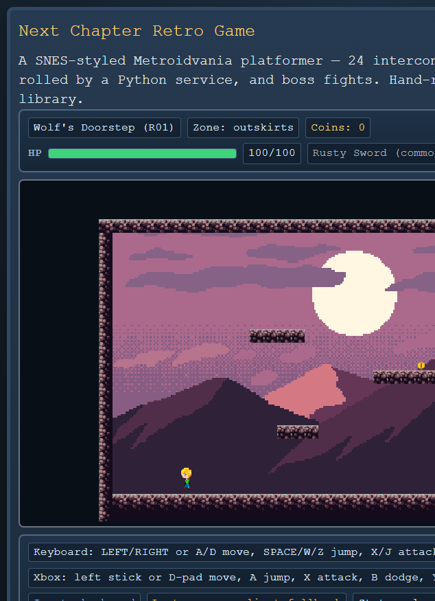
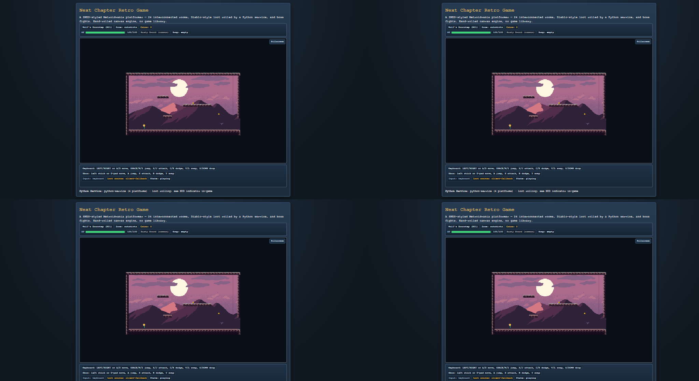

# UI Refactor Brief — responsive canvas, header/footer HUD, input reliability, sprite transparency

> Handoff task list for a VS Code agent session, written 2026-07-08 after the first
> human playtest. Read docs/AGENTIC_WORKFLOW.md and docs/SESSION_LOG.md first —
> this repo verifies agent claims against `python scripts/project-status.py`, and
> "done" without pasted command output doesn't count.

## Ground rules (non-negotiable)

1. **No parallel systems.** All game logic lives in `lib/game/game.ts` (Game class)
   + `lib/game/input.ts`, `items.ts`, `world.ts`, `levelLoader.ts`, plus shared
   `lib/gameLoop.ts` / `lib/audioManager.ts`. This repo previously had THREE
   competing implementations built by agents that didn't check each other's work;
   they were consolidated. Extend these files — do not create a second canvas
   component, second input handler, or second HUD path. If you believe something
   must be replaced instead of extended, say so and log an ADR in docs/DECISIONS.md.
2. **These are UI/presentation and asset-pipeline tasks.** Do not modify combat,
   loot, physics, or world data except where explicitly listed below.
3. Run `npx tsc --noEmit` and `npm run dev` after each task; verify in a real
   browser; paste actual output/screenshots per task. Update docs/SESSION_LOG.md
   at the end using its existing entry format.
4. Commit per task with descriptive messages. Show the diff before committing.

## Task 1 — Responsive canvas scaling (currently fixed 640px, ignores window size)

**Symptom:** enlarging the browser window doesn't enlarge the play area.
**Cause:** `components/GameCanvas.tsx` wraps the canvas in
`
` — a hard 640px box. The canvas inside has
`width: 100%` but its parent never grows.

**Required design:**
- Keep the INTERNAL resolution exactly `VIEW_W×VIEW_H` (640×352). It is the room
  size in pixels; game logic and rendering depend on it. Scale by CSS only.
- Scale the canvas to the largest size that fits the viewport space remaining
  after the new header/footer (Task 2), preserving 640:352 aspect.
  `aspect-ratio: 640 / 352` + `width: min(100%, calc((100dvh - var(--chrome-h)) * (640 / 352)))`
  or a small ResizeObserver — either is fine.
- Preferred: snap to INTEGER multiples of 640×352 when the fit allows (1×, 2×, 3×)
  so pixels stay crisp; keep `image-rendering: pixelated` either way.
- Optional nice-to-have: a fullscreen toggle button using the Fullscreen API on
  the canvas wrapper.
**Verify:** resize the browser from ~800px to full 4K width; the play area must
grow/shrink smoothly, never distort, never blur.

#### Reference screenshots

| 800 px window | 2560 px window |
| --- | --- |
|  |  |

## Task 2 — Header/Footer chrome outside the canvas (persistent player feedback)

**Symptom:** HUD overlays the top of the play area (`components/HUD.tsx` is
absolutely positioned over the canvas); control hints only exist on the start
screen (`app/page.tsx`) and vanish once you press Start.

**Required design:**
- New `components/GameHeader.tsx`: HP bar, coins, weapon (+rarity color), swap
  slot, room name, boss HP bar when active. Rendered ABOVE the canvas, always
  visible during play.
- New `components/GameFooter.tsx`: control hints (keyboard AND Xbox mappings —
  copy the accurate text from app/page.tsx), gamepad connected/keyboard indicator,
  loot-source indicator (python-service vs client-fallback), and the transient
  message line (pickups, door unlocks).
- Both consume the existing `HudSnapshot` — `GameCanvas.tsx` already receives it
  via `game.onSnapshot`; lift that state up to `app/page.tsx` (or a small wrapper)
  and pass it down. DO NOT add a second snapshot mechanism or poll the Game class.
- Keep in-canvas rendering only for in-world things: death/victory overlays stay.
  Delete or gut `components/HUD.tsx` overlay usage rather than leaving a duplicate
  HUD path (ground rule 1).
- Layout: header / canvas (flex-grow, Task 1 scaling) / footer, filling the
  viewport; the old marketing copy on app/page.tsx can move below the fold or
  onto the start screen only.
**Verify:** screenshot showing header+footer persistent while the player moves,
picks up loot (message appears in footer), and fights a boss (boss bar in header).

## Task 3 — Arrow-key reliability ("controls sometimes shift to WASD-only")

**Symptom (from playtest):** intermittently the arrow keys stop moving the player
while WASD keeps working.
**Where to look:** `lib/game/input.ts` binds both arrows and WASD in
`KEY_BINDINGS`; `keydown` listener is on `window` and calls `preventDefault()`
for bound keys. Plausible causes to actually test, in order:
  1. Focus leaving `window` (iframe/devtools/address bar) so keydown never
     arrives — while WASD "keeps working" only because the user re-pressed after
     refocus. The blur-release handler added 2026-07-08 releases held keys on
     blur by design; confirm refocus behavior isn't eating the first arrow press.
  2. Browser scroll-restoration: without preventDefault reaching the listener
     (e.g., if another handler stops propagation), arrows scroll the page instead.
     Check nothing else on the page listens for arrows.
  3. `pressed` edge detection in `InputManager.update()` if `update()` ever runs
     twice per frame (double rAF) — verify GameLoop only ticks once.
**Required:** find the actual cause with a repro (log keydown events + held-state
per frame), fix it, and document the finding in SESSION_LOG. Do NOT just rebind
keys or fork the input path. If focus is the culprit: give the canvas wrapper
`tabIndex={0}`, focus it on start, and consider listening on `document` instead
of `window` — all inside the existing InputManager.
**Verify:** describe the repro you found and show it fixed (before/after behavior).

## Task 4 — Demon-flower sprite has an opaque blue box (GIF transparency lost)

**Symptom:** the white flower creature renders inside a solid blue rectangle
(see playtest screenshot; enemy "flower", sheet `public/sprites/flower.png`).
**Cause:** `scripts/prepare-assets.py :: gif_frames()` does
`im.convert("RGBA")` per GIF frame without honoring the GIF's palette
transparency index, so `mon4_idle.gif` / `mon4_attack2.gif` frames keep their
background color as opaque pixels.
**Required fix in `gif_frames()` (asset pipeline only — no TS changes):**
  - Respect `im.info.get("transparency")` when converting palette frames
    (convert the palette frame with its transparency index applied — e.g. via
    `im.convert("RGBA")` AFTER `im = im.convert("P")` handling, or PIL's
    `ImageSequence` + per-frame `.info`), and
  - As a safety net, chroma-key: sample the corner pixel of each frame; if it's
    non-transparent and uniform along the border, map all matching pixels to
    alpha 0. (The mon4 background is a solid color.)
  - Re-run `python scripts/prepare-assets.py` and confirm the regenerated
    `public/sprites/flower.png` has a transparent background (paste the script
    output; visually verify in-game).
  - Audit the other packed sheets for the same class of bug while you're there
    (bat/goblin/imp came from PNGs and should be fine — verify, don't assume).
**Verify:** in-game screenshot of the flower with no blue box, on at least two
different zone backgrounds.

## Definition of done (all tasks)

- `npx tsc --noEmit` clean and `npm run dev` starts without errors (paste output)
- Real browser screenshots proving each of the four fixes
- `python scripts/project-status.py` run at the end; git committed per task,
  tree clean
- docs/SESSION_LOG.md entry describing what was found (especially Task 3's root
  cause) using the existing format — honest about anything left unfixed
